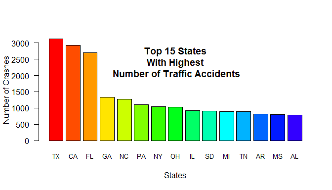
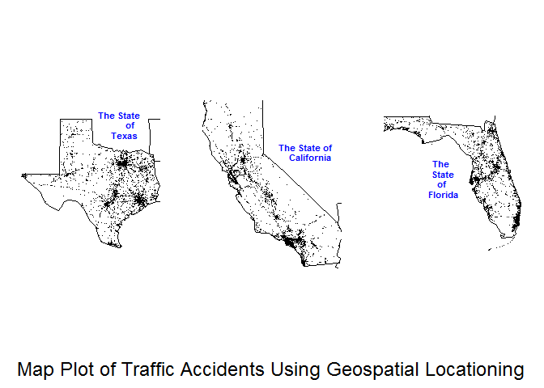

## Package FARSread

[](https://travis-ci.org/DocOfi/FARSread-Package)

[](https://ci.appveyor.com/project/DocOfi/FARSread-Package)

The goal of this package is to create a summary and visualization of the Fatality Analysis Reporting System (FARS) data from the National Highway Traffic Safety Administration [NHTSA](www-fars.nhtsa.dot.gov/Main/index.aspx). FARS contains data derived from a census of fatal motor vehicle traffic crashes within the 50 States, the District of Columbia, and Puerto Rico. 

Interested parties may access data tables at [NHTSA](www-fars.nhtsa.dot.gov/Main/index.aspx), download files via FTP at ftp://ftp.nhtsa.dot.gov/fars/, or make requests through the [Publications and Data Requests page](www-nrd.nhtsa.dot.gov/Cats/Index.aspx). Information requests can also be made by phone at 800-934-8517, or by e-mail at ncsaweb@dot.gov. 

### Summary tables

The family of functions available in this package will allow the user to read and analyze the data in R. The summary tables provided by the function `fars _summarize_years` shows the number of observed accidents per month in a particular year. The resulting table can then be plotted.





### Data visualization

The package provides a function `fars_map_state`,that allows the user to visualize the location of accidents in a particular State in a particular year.  The output of the function is a map plot based on the longitude and latitude data in FARS.





### File format

The function `fars_read` requires the data to be in a .csv format while ther rest of the other functions in this package require that the data be in .csv.bz2 format. In order to change a .csv file to .csv.bz2 format, you'll have to read the file first into R using the `fars_read` function and assign the result to an R obect like `R_variable`. You may then use the write.csv function in R to create the a file `file_name.csv.bz2` as shown in the code below. Be sure to add the argument `row.names = FALSE` to avoid creating a new column/variable of row numbers. You may then use the function `fars _summarize_years` to create the summary table described above as well as the function `fars_map_state` to create the map plot.

```
R_variable <- fars_read("accident_2013.csv")
write.csv(R_variable, file = bzfile("file_name.csv.bz2"), row.names = FALSE)

```
### Vignettes

To view the html files in the vignettes folder, click on the following links:

[introduction-to-FARSread](https://htmlpreview.github.io/?https://github.com/DocOfi/FARSread-Package/blob/master/vignettes/introduction-to-readfars.html)       


[Farsread_Functions](https://htmlpreview.github.io/?https://github.com/DocOfi/FARSread-Package/blob/master/vignettes/functions-readfars.html)

> *“Because Traffic has a memory. It’s Amazing!!! It’s like a living organism”* 

> >  - Ethan Hunt, Mission Impossible


